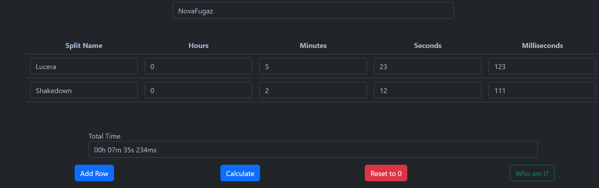
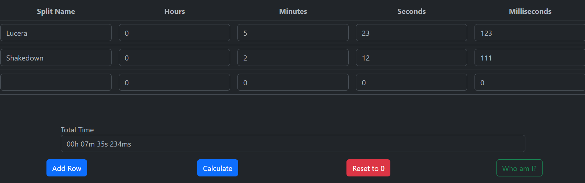
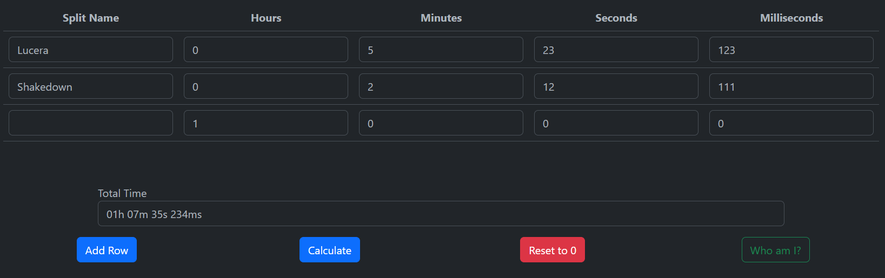
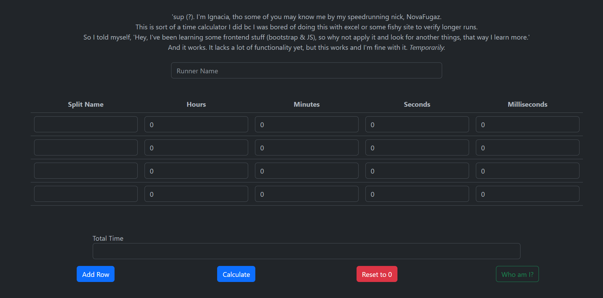
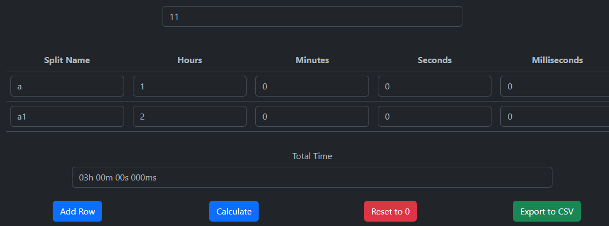
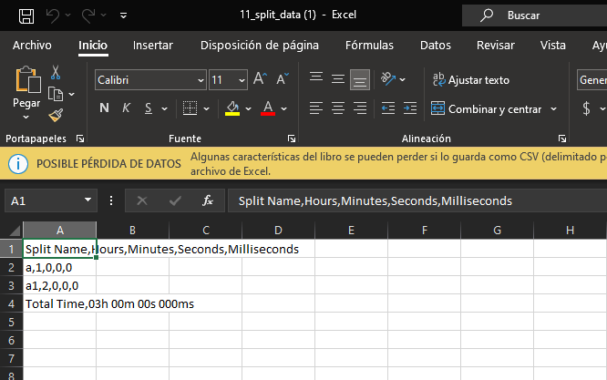
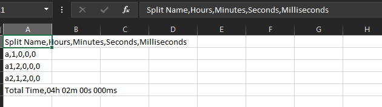

# Nacchi's Time Calculator

tbh, I grew tired of looking for proper options to calculate longer speedruns times. I loathe Microsoft Excel a lot. A LOT. More so when I try to calculate a time and it doesn't work. So I opened VS Code and said "let's do this". And although there are a lot of pages that can do this, this is a lot easier and it loads faster and also helps me learn things. Win/Win situation.

Yes. *This is literally a **"fine, I'll do it myself"*** project, made out of pure spite.

And yes, I don't know how to create a readme.

### Update (20/08/2023)

The TimeCalculator now exports to csv and the explanation container was removed now that this readme has been done and I have my own one.

## Contents

- [Screenshots](#screenshots)
- [To-Do](#to-do)
- [Links](#links)

## Overview

### Screenshots

The calculator has working rows for time calc purposes for each, ms, ss, mm and hours. Also the split name was added in the last edition so I could trace it accordingly. I want to stress this enough, this was made only because I need to time a 4ish hour run and I want to do it properly.

When opened "add row" another row is added at the bottom. No input added is cloned when this button is pressed and calculations proceed every time you press "calculate"

If "reset to 0" is pressed every row that had had its input value modified is reset to "0". The split name is resetted to an empty value. The added rows stay there. They are removed if you reload the page.

Now the NTC is able to export data from the rows to a csv. It works also on extra rows, so don't worry, it won't be a mess :3

## To-Do

Temporarily, I want to add some things, and I'll list them here.

- I want to add an slider that let's y'all select night/light mode. (That may come soon, I already know how to do that, but I don't want to break the minimal design) with an awfully placed slider.

- Add a favicon.

- I don't know if I should add to the reset to zero button the function to remove the added rows. I think I'll leave it in this current status. You can always reload the page and for many long runs of the same game (I'm looking at you, F1 2010 runs), it's better to have it that way.

I think that's it.

## Links

My github is this one, hi (?).
The calculator is live on: [Nacchi's Time Calculator](https://novafugaz.github.io/timecalc/) and I'm open to questions in here, my [twitter](https://twitter.com/NovaFugaz) and my speedrun.com account ([NovaFugaz - speedrun.com](https://www.speedrun.com/user/NovaFugaz)).
